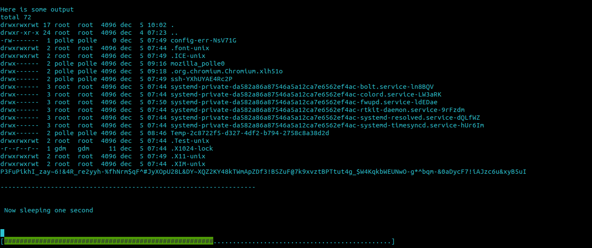

# bash_progress_bar
This script is intended to be sourced by other bash scripts. It will allow those scripts to create a progress bar which does not interfere with the scrolling output of the script. The idea for this progress bar is based on the progress bar used by APT. 

What makes this progress bar different from the basic terminal progress bars which use carriage return (`\r`) to overwrite its own line, is that this progress bar does not interfere with the normal output of your script. This makes it very easy to update existing scripts to use this bar without having to worry about the scrolling of your output.

An example can be viewed in `test_bar.sh`. The actual implementation can be found in `progress_bar.sh`

Example output:

